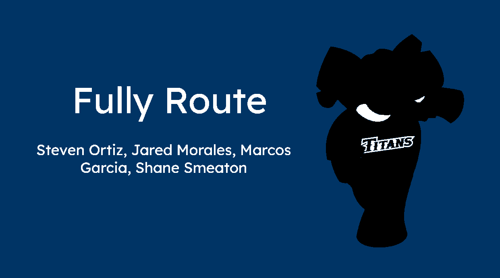

A platform aimed to help CSUF students, faculty & visitors navigate and familiarize themselves with campuses infastructure like buildings, rooms and points of interst.
This platform will be a website that guides users to a desired location within the campuses infrastructure from a given location within the campus. Furthermore, It will provide live instructions to get you to your desired location. Users will have the ability to enter a Building Name or Room Number and also point of interest locations like "Elephant Statue".

---

## Running the database

Needs [Docker Desktop](https://www.docker.com/products/docker-desktop/). From the repo root:

```bash
docker compose up -d
```

PostgreSQL 17 with PostGIS listens on `localhost:5433`, database `fullyroutedb`, user `postgres`, password `devfullyroute`.

Stop it with `docker compose down`. Add `-v` to also wipe the data volume.

Full setup and DBeaver instructions are in [docs/installation.md](docs/installation.md).
